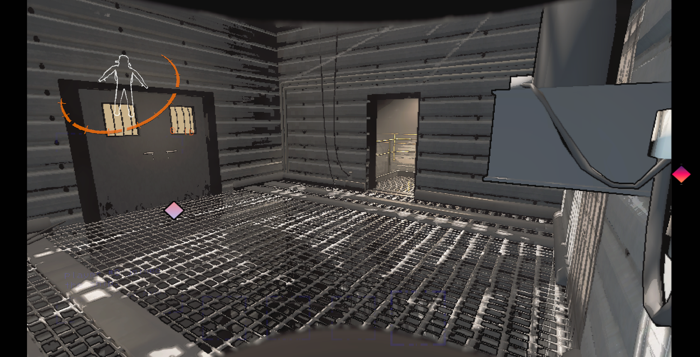

# 
ExitPointer

# 
[中文](README_zh.md)

___

  

 Displays an image to help you find the exit after you enter the building. 

## Features
___
Displays two markers pointing to the main entrance and back door after you enter the building.

## How to use
___
- Install [BepInEx](https://github.com/BepInEx/BepInEx).
- Launch the game to let it automatically create the BepInEx folder (if this is your first time using BepInEx).
- Drop `ExitPointer.dll` into the `BepInEx/plugins` folder.
- Then you can start enjoying the game!

### Notes
___
- This mod is my first project after learning C# (yes, first project, not just the first mod), so the code might be quite **messy**. If you have any suggestions, feel free to open an issue or PR.
- To be honest, this mod somewhat reduces the difficulty of the game, which I feel goes against the original intent, as this is supposed to be a maze game. The initial idea was actually meant for designing reverse teleportation.
- It may not be compatible with the [Mimics](https://thunderstore.io/c/lethal-company/p/x753/Mimics/) mod or third-party maps, as it hasn't been tested.
